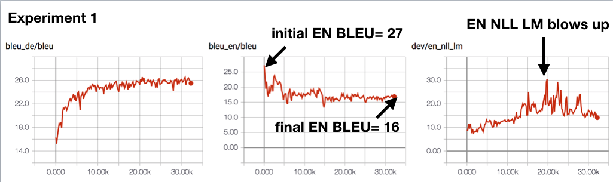
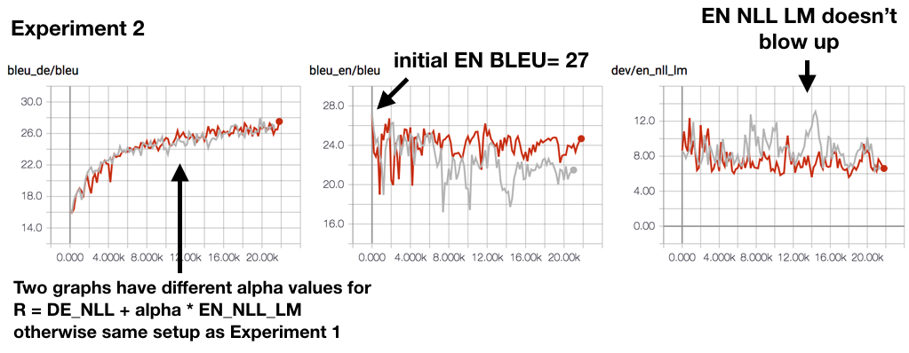

# Why Grounding Matters: Lessons from Emergent Communication

Repository Structure
---------------------
* `src/run.py` is the main script for parsing hyperparameters and running training/testing, runs either individual translation agents or joint agents.

* Hyperparameter names and default values are defined in `src/hyperparams_single.json` (for pre-training individual language pair translation agents), or `src/hyperparams_joint.json` (for fine-tuning Fr->En and En->De agents jointly).

* Hyperparameter default values in the `.json` files can (or should) be overwritten by command line arguments.
  * This is handled by `src/hyperparams.py`, which is called in `src/run.py`.
  * Basically, it reads command line arguments of the format (`--blahblah blahblah`), and saves it into the hyperparameter dictionary (overwrites previous value if exists).
    * Note: True/False boolean values are passed as string, (e.g. all of these work: `--debug true`, `--debug false`, `--debug True`, `--debug False`)
  * Example: `python run.py --D_emb 256 --D_hid 256 --debug true`
  * This is also how I run grid search, for more details see below.

* To run grid search:
  * For each experiment, define hyperparameters you want to grid search over as a list in json file, (e.g. in `scripts/180821_02_joint_exp2.json`, we're grid searching over `h_coeff` 0.0 and 0.001).
  * `sweep.py` takes the json file, and produces a cartesian product (and prepares it into `--blahblah blahblah` format that `src/hyperparams.py` can parse), and launches SLURM job commands.
    * Example: `python sweep.py --json 180821_02_joint_exp2.json --shuffle --queue priority --memory 25 --hours 24`
    * Pass the `--test` flag to just see what the commands look like (for debugging purposes), but not actually launch SLURM commands.

## Dataset
* Vocabulary : separate vocabularies for EN / DE / FR, but shared between IWSLT and Multi30k
  * Merged the two datasets and extracted a shared BPE vocabualry
* IWSLT : `/private/home/jasonleeinf/corpora/iwslt/en-fr`
* Multi30k : `/private/home/jasonleeinf/corpora/multi30k/data/task1/new`

## Pretraining individual agents on IWSLT
* Experiment hyperparams defined in `scripts/180815_01_en_de.json` (for En->De) and `scripts/180817_01_fr_en.json` (for Fr->En)
* Saved checkpoints periodically (`save_at` hyperparameter defined in `src/hyperparams_single.json`)
* Best models (loaded in `src/run.py`):
  * Fr -> En : `08.17_21.52._single_rnnattn_fr_en_emb256_hid256_1l_lr3e-04_linear_ann500k_drop0.2_clip0.1_`
  * En -> De : `08.17_01.38._single_rnnattn_en_de_emb256_hid256_1l_lr3e-04_linear_ann500k_drop0.3_clip0.1_`
  * See Quip document for their BLEU scores

## Pretraining language model on MS COCO + WikiText2
* Language model experiments in `src/lm3`
* Best model : `src/models/multi30k_RNN_emb400_hid400_lr20_drop0.3_voc10000_batchsz64__bpe_penalise_same.pth` (called in `src/run.py`)
* EN vocabulary for LM : used the same BPE vocabulary as our agents (this seems to help make the LM more useful in deciding natural / not)

## Experiment 1: Policy Gradient Tuning Destroys Natural Language
Take pretrained models. Finetune intermediate EN with RL.
Reward: NLL_DE

Show that:

* DE BLEU goes up
* EN BLEU goes down
* EN LM perplexity goes up
* Qualitatively, the EN sentences are bad

### Experiments and results
* Hyperparameters defined in `scripts/180821_02_joint_exp1.json`.
* Tensorboard event files in `/checkpoint/jasonleeinf/groundcomms/event/180821_02_joint_exp1`

## Experiment 2: Rewarding for "Naturalness" Is Not Enough
Take above setup, but add extra reward for naturalness.
Reward: NLL_DE + NLL_EN_LM

Show that:

* DE BLEU goes up
* EN BLEU goes down less than in Expt 1
* EN LM perplexity stays similar or goes down
* Qualitatively, the EN sentences look like EN but do not correspond

### Experiments and results
* Hyperparameters defined in `scripts/180821_02_joint_exp2.json`.
* Tensorboard event files in `/checkpoint/jasonleeinf/groundcomms/event/180821_02_joint_exp2`

## Experiment 3: Grounding To The Rescue
Take above, but add additional reward for a third agent being able to
predict the correct image from the EN communication.
Reward: NLL_DE + NLL_EN_LM + NLL_PRED_IMG

Show that:

* DE BLEU goes up
* EN BLEU stay similar or goes up
* EN LM perplexity stays similar or goes down
* Qualitatively, the EN sentences correspond better

## Experiment 4: Common Ground and Grounding
Take above, but add multiple agents. They need to establish a common
ground while being grounded in the images.

Show that:

* This works even better than Expt 3.
* Examine which is better, community or grounding.
